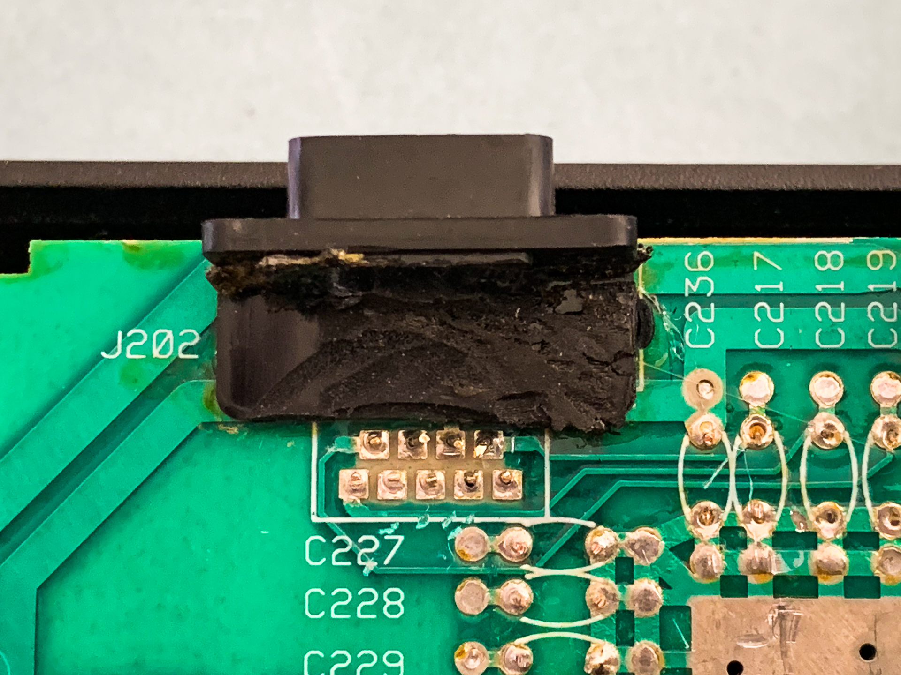

# Atari 2600 4-switch woodgrain housing for RetroPie

Walkthrough of modding Atari 2600 console to house Raspberry Pi loaded with [RetroPie](https://retropie.org.uk/). This mod features no external modification to Atari 2600 console, all original switches working in Retropie to provide their original functionality when emulating Atari 2600, USB access through Atari joystick ports, safe power switch, access to Raspberry Pi SD-card slot without opening the case, ability use original Atari 2600 joysticks, LED power light, and game cartridge USB passthrough modifications.

This repository documents steps taken and modifications done to Atari 2600 hardware to realize this project. Software modifications required for RetroPie and ControlBlock to complete the project are documented in a separate repository [link added later]. 

  

# Hardware components

This mod utilizes following hardware:

- Atari 2600 4-switch console, game cartridge and Atari joystick
- RaspberryPi 3b (rPi 4 notes will be added later when project is updated to use it)
- PetrockBlock ControlBlock v2.1
- Retronic design Universal DB9 to USB joystick adapters
- Accessories: USB 2/3 extension cables, microSD card extension cable, LED diode light, prototyping cables

Please see below for additional details of where to source them, and how they are used.

## Atari 2600 case and game cartridges

[Ebay is full of not working Atari 2600](https://www.ebay.com/sch/i.html?_from=R40&_trksid=m570.l1313&_nkw=atari+2600+not+working)'s for less than $40. Look for units that appear to be in great outward condition and available for agreeable price. When you have a unit selected for this project, [take it apart](https://www.ifixit.com/Teardown/Atari+2600+Teardown/3541) and wash all the plastic parts with soap and water and [clean the circuit board](https://atariage.com/forums/topic/167442-question-about-cleaning-an-atari-2600-circuit-board) and test that the switches work using e.g. multimeter.

   

## RaspberryPi

This project is originally built around [Raspberry Pi 3 Model B](https://www.raspberrypi.org/products/raspberry-pi-3-model-b/). Once PetrockBlock ControlBlock is available with USB-C, it will be upgraded to rPi 4. Raspberry Pi 4 has few advantages over 3 that make it great for this project: beefier CPU/GPU, micro HDMI (less bulky cables), USB3, better power management.

## PetrockBlock ControlBlock

[PetrockBlock ControlBlock](https://www.petrockblock.com/controlblock/) rev 2.1 is utilized to provide true power switch functionality and handle Atari 2600 switches. ControlBlock driver needs modifications to be able to support Atari 2600 'TV mode' and 'Game Difficulty' switches for player 1 and player 2. Driver modifications are required because Atari 2600 switches are not simple on/off switches, but instead both switch positions indicate state (e.g. TV-Type 'off' state indicates 'black and white TV', and on-state indicates 'color TV'. Stock ControlBlock driver (as of 06/2020) does not support this kind of switches where on and off states would send a different key press. Modified driver is available in this[LINKTOBEADDED] repo and will be installed by software install scripts found in that repository.

## Retronic design Universal DB9 to USB joystick adapters

[Retronic Design](https://www.retronicdesign.com/en/) Universal DB9 to USB joystick adapters ([link](https://www.ebay.com/itm/Universal-DB9-to-USB-joystick-adapter-2-PACK/174273063854)) make it possible to use original Atari 2600 joysticks with this setup. 

  

## Other hardware needed

- USB 2/3/C extension cables ([link](https://www.amazon.com/AmazonBasics-Extension-Cable-Male-Female/dp/B00NH11R3I/)) ([link](https://www.amazon.com/Extension-NC-XQIN-Transfer-Playstation/dp/B07F1PVHBM/ref=sr_1_3)) ([link](https://www.amazon.com/Extension-HuaLong-Extender-Compatible-Thunderbolt/dp/B07ZJ35NYY/))
- HDMI extension cable ([link](https://www.amazon.com/dp/B01D5H8ZI8/ref=twister_B01MG4DIDO?_encoding=UTF8&psc=1))
- Micro-SD TF-to-TF card reader extension cable ([link](https://www.amazon.com/Extension-Electop-MicroSDHC-Compatible-Raspberry/dp/B07YYSP5F5/))
- LED light ([link](https://thepihut.com/pages/search-results?q=led%20pack))
- Jumper or prototyping wires ([link](https://thepihut.com/pages/search-results?q=jumper%20wires&page_num=3)) 

## Tools used

- Hot glue gun & hot glue
- Dremel 
- Soldering iron and solder remover
- Multimeter
- Pliers, screw drivers, sharp knife

# Atari 2600 hardware modifications

While this project avoids external modifications to the Atari 2600, extensive internal modifications are needed and hot glue is used non-sparingly to attach and hold components. Therefore it is doubtful that the Atari 2600 case used for the project could be later repurposed for all-original-parts Atari 2600 project. In summary, following alterations are done:

- remove all/most electronic components from the motherboard
- solder prototyping wires to the switches on motherboard
- attach prototyping wires to CPU socket to provide USB connectivity through game cartridge slot
- perforate Atari joystick ports and install USB sockets inside them
- attach HDMI extension / socket and Micro-USB extension / socket to the Atari case top
- attach SD-card TF-to-TF extension cable and LED to the Atari case bottom
- connect everything to RaspberryPi and PowerBlock and attach RaspberryPi inside the case
- modify game cartridge to house USB sockets

## Atari 2600 4-switchers

Four switchers have much more room inside to work than 6 switchers. They are also still available in great numbers so there is less reason to feel too bad about modifications required by the mod.

### Atari 2600 motherboard preparations

Atari 2600 motherboard will be mutilated beyond repair so try and use one that wasn't working to begin with. To prepare it for the project, use this 'checklist':

- remove shielding to expose CPU and other components
- remove CPUs from their sockets
- do NOT remove original switches, game slot and CPU sockets (except TV mode switch, power connector socket)
- remove all the other electronic components with micro shears except those mentioned above (desoldering tool is required to remove e.g. TV tuner and channel switch)
- solder prototyping cables to remaining switches (make sure to use multimeter to test that you select appropriate pins to solder cables to)
- see section 'Cartridge slot USB2 pass-through' for connecting Pi USB2 ports to CPU socket

After these changes, it's important to put a bottom part of the shielding back in place. This is needed for properly re-aligning PCB when closing the case. Top of the shielding would block HDMI and power cables, so it won't be put back in place.

 

### USB sockets to Atari 9-pin joystick ports

Joystick ports of the Atari 2600 chassis are repurposed to house USB sockets. This allows game controllers, keyboard, and e.g. USB flash drives to be connected to Retropie. USB 3 cables are used for forward compatibility with Raspberry Pi 4.

To be able to fit USB extension cables female sockets through the Atari joystick port, use diagonal cutting pliers etc. to carefully remove plastic casing around the socket. It is important to remove enough of the plastic casing around the socket, because otherwise cable won't fit through the joystick port, or it will not align properly when inserted through the port. 

To perforate joystick ports, use Dremel etc. cutting tool and carefully cut away main parts of the joystick port, and then perforate what's left to make room for the USB socket. After cutting away and removing original pins, it's possible to detach the joystick port from the motherboard, and fasten it gently with bench vice to perforate and clear the entryway for the USB socket. 

As original pins are no longer holding the joystick port in place, use hot glue to attach it to the motherboard. Then push the USB extension cable's female end through the joystick port, make sure it is in the appropriate position and angle and use hot glue to cement it in place.

   

As seen in the above pictures USB3 cables are thicker than USB2 cables. When routing them, make sure not to even partially block screw holes on Atari PCB used for Atari case top as this will make it impossible to close the lid and have it align properly. There is very little space above the USB connectors put inside joystick ports when the top is in placeL. Therefore it may be required to shave off some of the casing, and make sure hot glue is not spilled on top of USB connectors.

### Attach HDMI cable and power cable to the lid

Mod uses Micro-USB extension cable for the power connector attached to the original Atari 2600 power connector location. Original hole in the case top is large enough for the Micro-USB female socket, but the extension cable needs to be shaped using e.g. sharp knife to exactly fit the hole. 

As the original location for the TV output cable is used for SD-card extension and power LED, HDMI female socket is made available via TV channel selection switch oprning in the Atari 2600 case. This switch would serve no useful function when the console is being emulated making it a perfect choice to remove. Similar to when installing Micro-USB extension socket, use a sharp knife to shape the end of the HDMI extension cable to exactly fit the opening in the Atari case top. 

Once a good fit has been found for micro-USB and HDMI extension cable, apply hot glue to attach them into the case.

Please note that original power connector and TV channel selector switches have to be desoldered and removed from the Atari 2600 motherboard in order to make room for the micro-USB extension cable and HDMI extension cable. 

HDMI extension cable will connect to the rPi HDMI output. MicroHDMI extension cable will connect to ControlBlock microUSB power input.

 

Standard HDMI connector is a great fit for the channel switch hole in the Atari case, whereas if a smaller Micro-HDMI cable would be used, then it would have to be attached differently to fill the remainder of the channel switch hole. This is something to keep in mind when upgrading to Raspberry Pi 4 that uses Micro-HDMI.
 
### Attach SD-card reader and LED to the case bottom

Atari 2600 4-switchers TV antenna cable pass-through is perfectly sized to fit one standard LED and Micro-SD reader. To be able to change Raspberry Pi Micro-SD card without having to open the console case and to have power LED indicator functionality a Micro-SD card TF-to-TF extension cable and a LED were installed to cases TV antenna cable pass-through. Power LED and Micro-SD card reader extension were glued in with hot glue. Note that SD-Card extension cable came with black casing around the reader, which was removed before installation.

## Cartridge slot USB2 pass-through

[This](https://www.reddit.com/r/RetroPie/comments/cmspbj/retropie_in_an_atari_2600_heavy_sixer/) project inspired modification to support USB passthrough via cartridge slot. This allows access to all four RaspberryPi USB ports (2 through Joystick ports (USB3), and 2 through cartridge (USB2)). 

   

### Preparering cartridge

[Open](http://www.racketboy.com/retro/game-cart-contact-cleaning-guide-the-right-way) cartridge carefully and extract circuit board (note that there are at least three different kinds of cartridge internal designs for Atari 2600). Remove the game ROM chip and any electronic components (desoldering tool required for removing ROM shielding). Clean connectors. 

Standard AmazonBasics USB2 extension cables are about perfect fit for being used as USB ports. Use dremel etc. cutting tool to create openings to the side of the cartridge to appropriate width & height for the USB2 extension connector to fit in (see pictures).

### Wiring USB extension to motherboard & cartridge PCB

Use two USB2 extension cables and cut them to appropriate length. Connect or solder cables to motherboards CPU slot pins and solder to cartridge ROM pins (see pictures). Note that ground wires for both cables go through the same pin here. Instead of soldering USB wires directly to cartridge slot pins on the motherboard, it's much easier to access the pins via now empty CPU socket pins.

Once assembled cartridge should look like pictures below. 

   

# RaspberryPi hardware setup

Details on how to configure hardware attached to the rPi. 

## ControlBlock installation and wiring

Please refer to [ControlBlock documentation](https://www.petrockblock.com/2014/12/29/controlblock-power-switch-and-io-for-the-raspberry-pi/) for how to install ControlBlock on rPi and for wire etc. locations. Atari 2600 switches are wired to ControlBlock as follows:

- Atari Power switch -> ControlBlock power switch pins (brown&black)
- Atari TV-mode switch -> P1 SW8 (blue)
- Atari Player A difficulty switch -> P1 SW7 (red)
- Atari Player B difficulty switch -> P1 SW6 (red)
- Atari Game select switch -> P1 coin (orange)
- Atari Game reset -> P1 start (gray)
- LED diode -> ControlBlock LED pins; make sure to get polarity right (LEDs longer foot is usually ANODE(+)) (purple&blue)
- microUSB power input -> microUSB extension cable from Atari 2600 case top

Each switch has two wires. One wire goes to ControlBlock as above, and another connects to the ground on ControlBlock. Ground wires from TV-Mode, and left difficulty are grouped into one (yellow gnd wire), and ground wires from difficulty B, Game select, and Game reset are grouped into one (green gnd wire).

 

Note that this setup leaves most of ControlBlock ports unused for possible future ideas.

## USB cables

Use USB3 extension cables for Atari joystick ports and connect them to the USB3 ports on RaspberryPi (only on v4). For the cartridge USB extension, use 4/5-wire USB2 extension cables and connect them to Raspberry Pi USB2 ports.

## RaspberryPi power connector

MicroUSB extension cable must be connected to PowerBlock MicroUSB socket (and not to Pi). Due to space constraints, see section 'Mounting Raspberry Pi' below for further details.

## HDMI cable

HDMI extension cable is attached to Pi HDMI output. Due to space constraints, see section 'Mounting Raspberry Pi' below for further details.

## Mounting Raspberry Pi into Atari 2600 chassis

To fit RaspberryPi and ControlBlock with HDMI and power cables attached inside the Atari 2600 case, it needs to be installed into an angled position. Use hot glue to install an appropriately sized block of nonconducting material to support the HDMI connector side of the rPi. Alignment is proper when rPi is at a slight upward angle where the HDMI cable and USB power cable fit in above the Atari 2600 circuit board, but low enough that the Atari 2600 case top can be closed without causing pressure on the cables. Lastly a tiny amount of hot glue will keep Raspberry Pi attached to the case bottom.

# Cost breakdown

Cost breakdown for the project is presented below. Grand total for the parts comes	down to $258.68. To put this in context, that is more than what used but working Xbox 1 S consoles are going for	in EBay.

- Raspberry Pi3 B+ Canakit (rPi, PSU, SD-card) from Amazon: $59.99
- Atari 2600 4-switcher, joystick and some cartridges from Ebay: $58.80 (including shipping)
- PetrockBlock ControlBlock rev2.1 from	petrockblock.com:  $37.90
- 2x USB2 extension cables from Amazon: 2x$7.05; $14.10
- 2x USB3 extension cables from Amazon: 2x$5.99; $11.98
- 1x HDMI extension cable from Amazon: $6.93
- 1x Micro-SD TF-to-TF card reader extension cable from Amazon: $12.99
- 2x Retronic Design Universal DB9 to USB joystick adapters from Ebay: $54.99 
- LED and prototyping wires: $1
